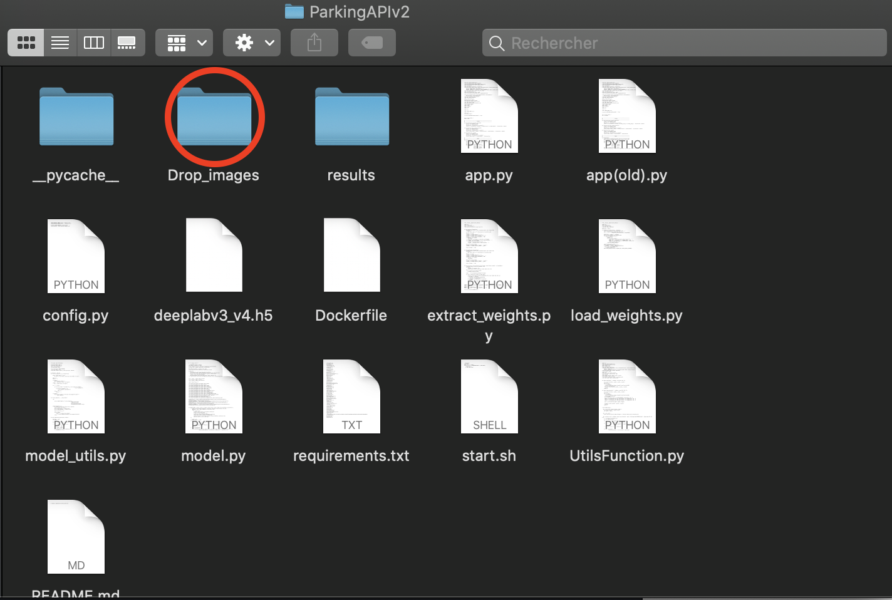
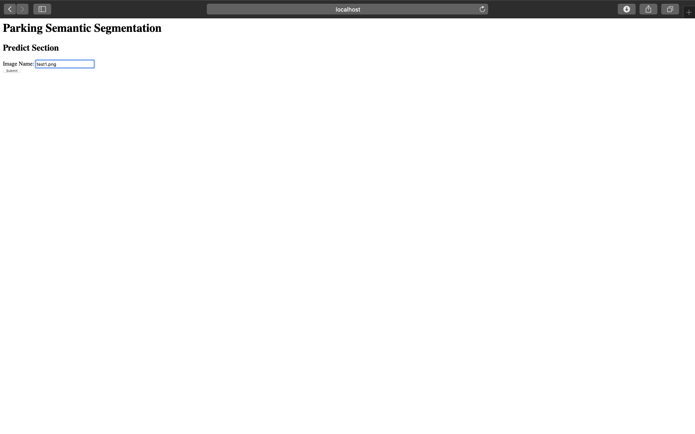
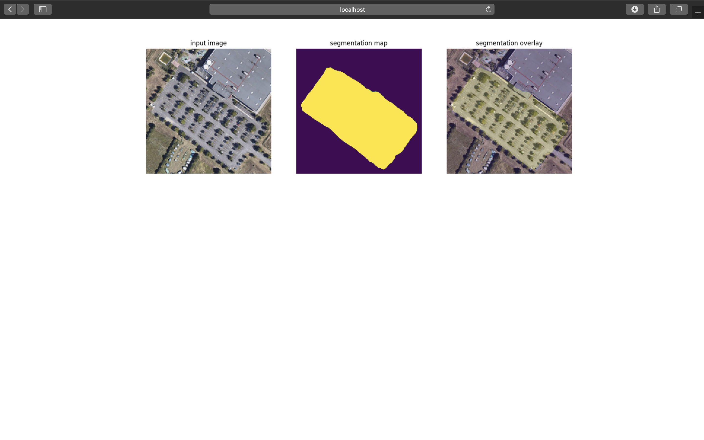
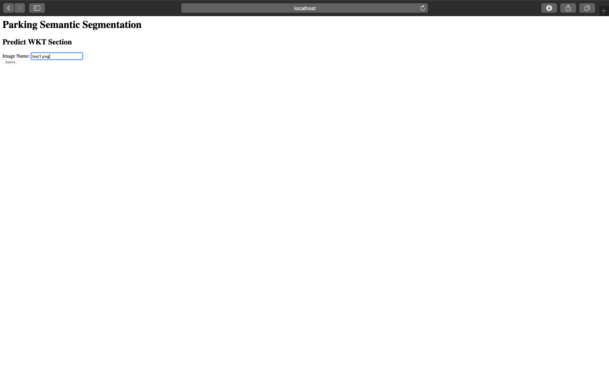
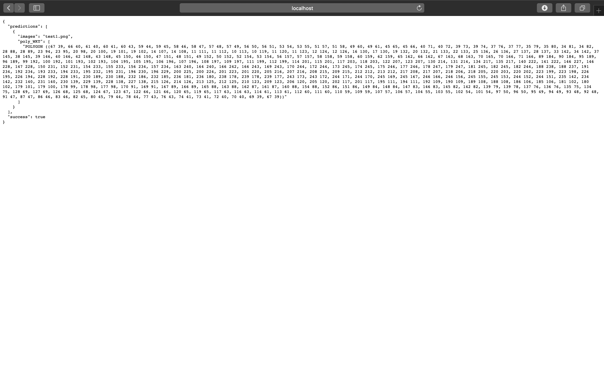
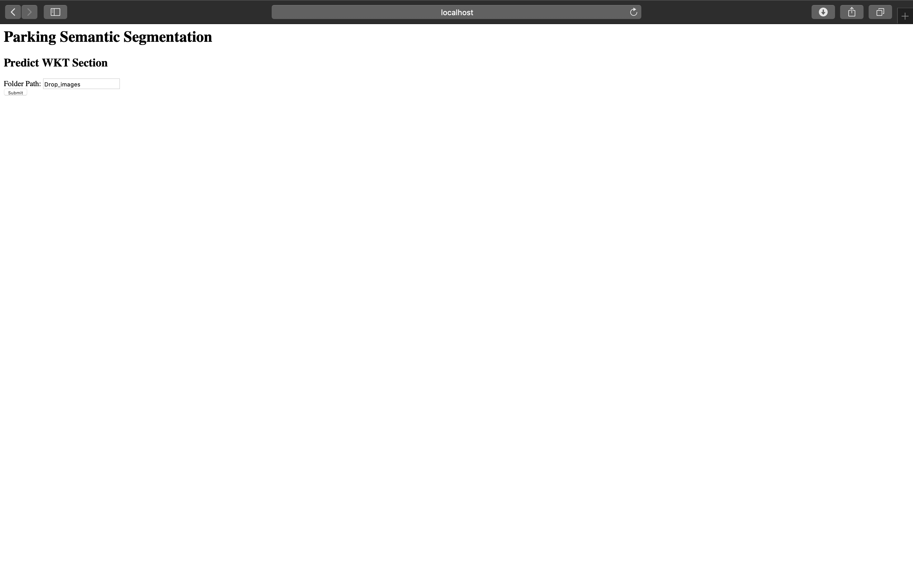
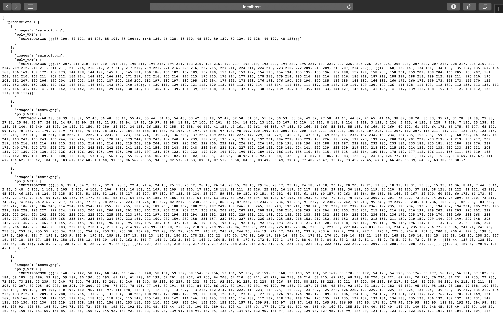

# Car Park Semantic Segmentation API (CPSS)


SSPD is a Flask rest API on a Docker container which allows you to create a wkt representation of parking on an aerial picture.

## How to install ?
Firstly you have to clone CPSS git and move to the directory:
```
git clone https://github.com/YHallouard/Car_Park_Semantic_segmentation.git
```
Build the docker image and start the docker container :
```
bash start.sh
```

## How to use it ?

Firstly, drop your images in the Drop_images folder.
  

### On web browser
Then you can access with your web browser to http://localhost:5000/.
##### On web browser -- Plot mask
From that point, this route (http://localhost:5000/predict) will lead you to that page. Enter a name of one among all pictures you dropped in the Drop_images folder.
  
You will get a plot to see how the API work on your picture. (This plot is also saved in the results folder.)



##### On web browser -- Get one WKT vector
This route (http://localhost:5000/predict_wkt)  will lead you to that page where you also have to provide the api with the name of one picture.
  
You'll get a WKT vector of the car park detected on this picture. (This wkt vector is saved in the prediction.txt file in the results folder)


##### On web browser -- Get WKT vector for a batche of pictures
This route (http://localhost:5000/predict/batches) will lead you to that page where you'll have to put the path of the folder containing your pictures. ex: Drop_images/pic1 or Drop_images.
  
You'll get a WKT vector of the car park detected on each picture. (WKT vectors are saved in the prediction.txt file in the results folder)


### Command line
You can do all upper action with the following command lines.

```
curl -X POST -F image=test1.png http://localhost:5000/predict
```

```
curl -X POST -F image=test1.png http://localhost:5000/predict_wkt
```

```
curl -X POST -F path=Drop_images http://localhost:5000/predict/batches
```
